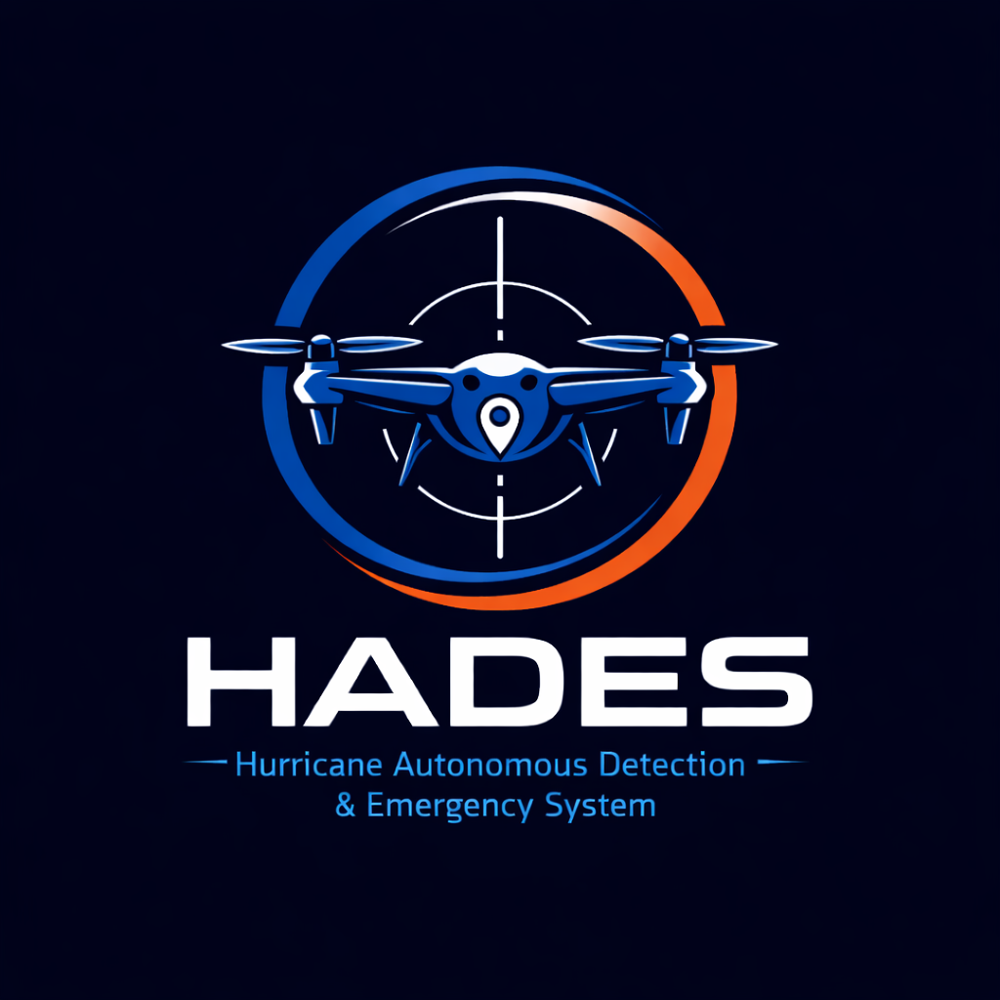
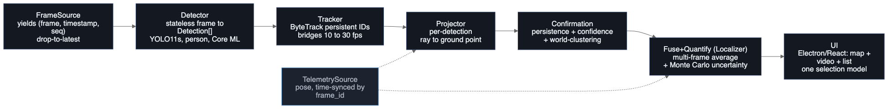
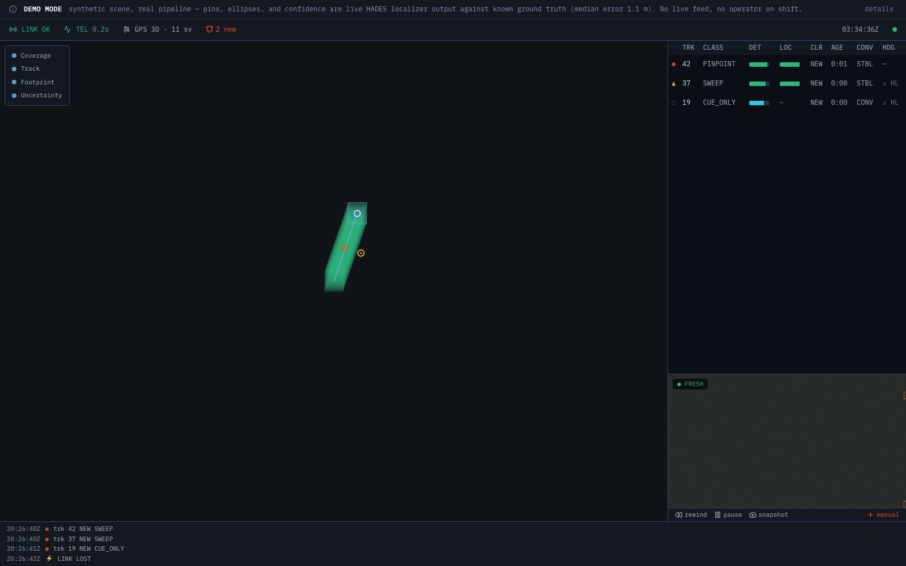
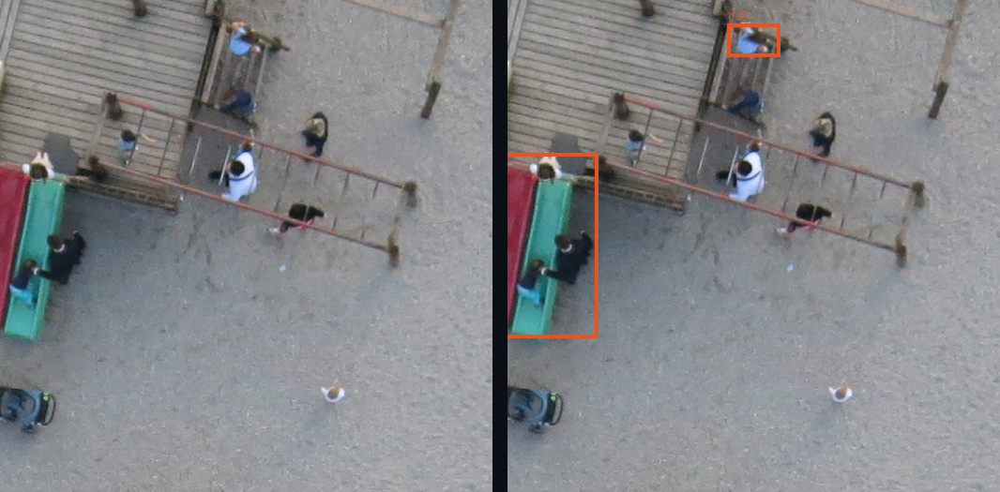
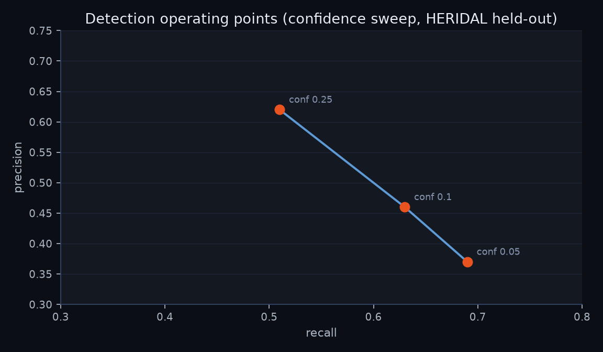
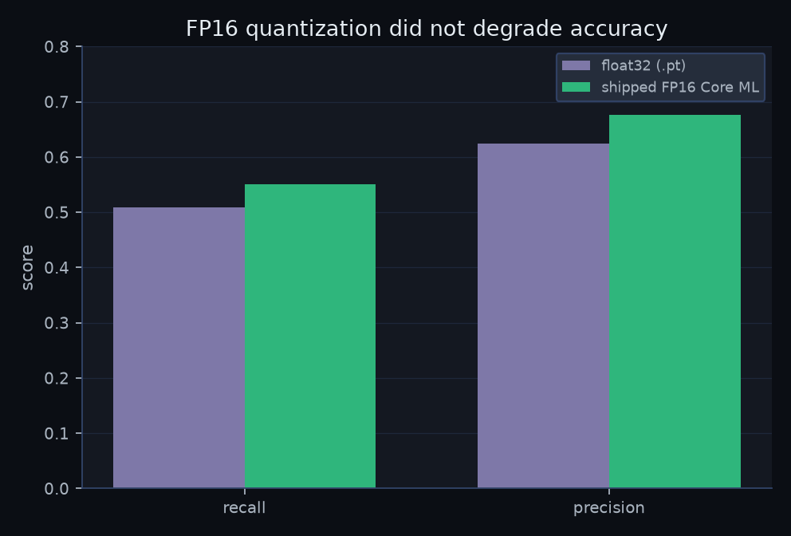
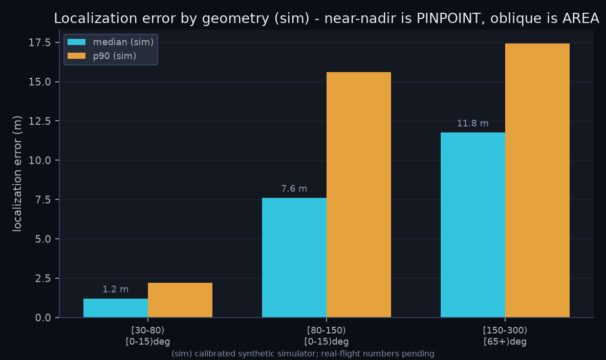
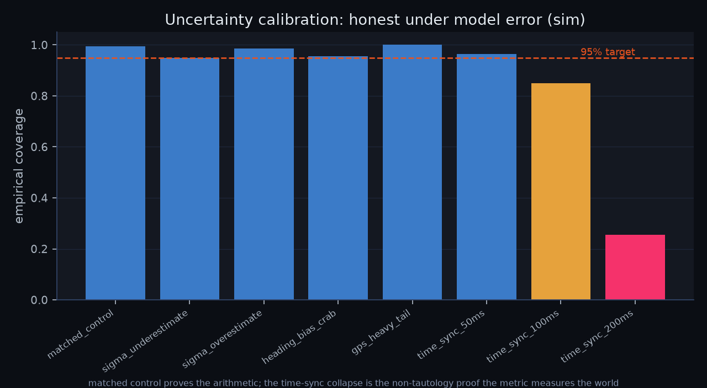
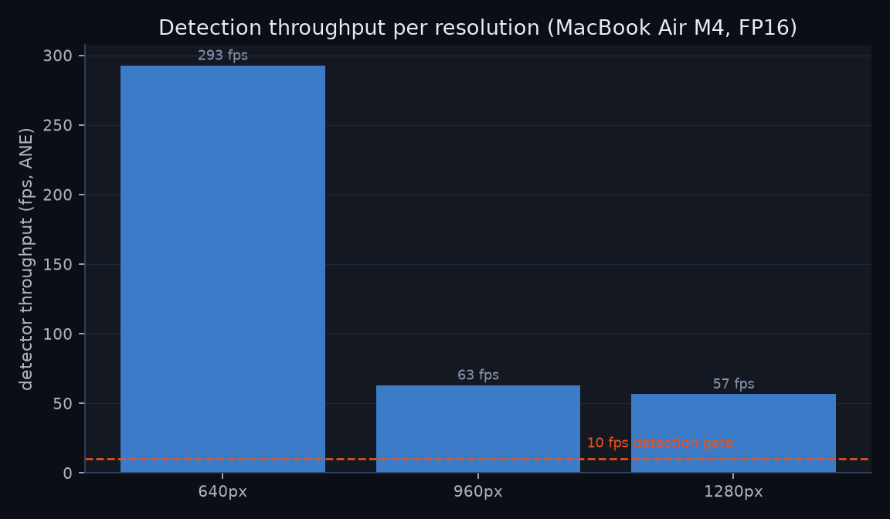
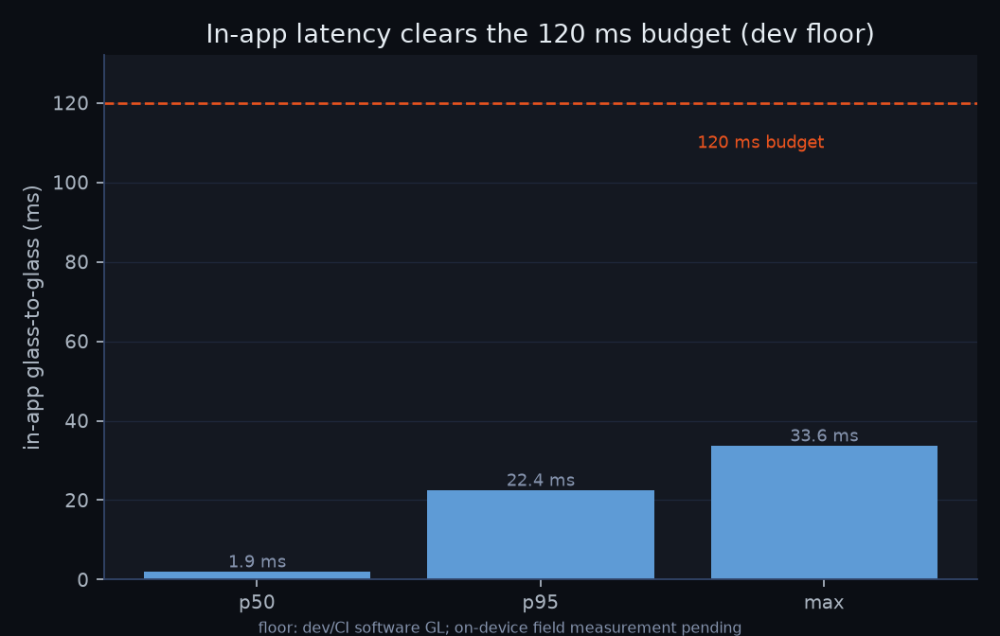

<div align="center">



### Hurricane Autonomous Detection and Emergency System

**A ground-control station for post-hurricane drone search-and-rescue.**

Ingest a live FPV-drone video feed, run real-time human detection on the frames, compute
real-world survivor coordinates with honest uncertainty, and present detections plus a live
survivor map in a coordinator UI that runs on a 16 GB MacBook Air in the field.

<br/>


-E6A23C?style=for-the-badge)

</div>

---

## What it does

HADES is a desktop app that supervises a Python detection service. Video displays at full frame
rate while detection, tracking, and localization run decoupled, so a survivor pin never costs
you a dropped frame. One contact flows through seven stages, each with a single responsibility:

<div align="center">



</div>

- **Detection** reads a frame and returns person boxes. YOLO11s fine-tuned on HERIDAL + SARD for
  tiny aerial people, exported to Core ML (FP16) and served on the Apple Neural Engine.
- **Tracker** gives detections persistent IDs and bridges the 10 fps detector to the 30 fps
  video (ByteTrack).
- **Projector** turns each detection into a ray and intersects it with the ground.
- **Confirmation** promotes a track by persistence, confidence, and world-space clustering. It
  sets display priority, never visibility.
- **Fuse + Quantify** averages a contact across frames and runs a Monte Carlo to produce an
  honest uncertainty ellipse and an actionability class (PINPOINT, SWEEP, AREA, or CUE-ONLY).
  It never emits a false-precision pin.
- **Coordinator UI** shows one contact in three projections (map, video, list) over a global
  selection model, with MGRS and WGS84 readouts, a degrade-visibly status spine, and an
  append-only mission log. Runs fully offline.

Two localhost WebSocket channels carry the data: one binary (JPEG frames), one JSON (detections
and telemetry), aligned by `frame_id` so every overlay lands on the frame it belongs to.

## Live demo

A static, click-to-run demo replays a canned mission through the real coordinator UI in a plain
browser. No install, no backend.

> **Demo link:** _to be published_ (see [Publishing the demo](#publishing-the-demo)).

<div align="center">



</div>

The demo is labeled **DEMO MODE**: the scene and drone pose are scripted, but every map pin,
uncertainty ellipse, and confidence value is live output of the HADES localizer run against
known ground truth. The banner reports the localizer's median error against that known truth
(1.1 m on this scripted scene). It is not a live feed.

---

## How well it works

Every number below traces to a real artifact produced in an earlier build phase. Detection
metrics are on a leakage-guarded HERIDAL held-out scene split (a custom by-scene re-split, not
the official HERIDAL test split, so numbers are not directly comparable to published benchmarks).
Localization numbers are from a
calibrated synthetic simulator (tagged `sim`) whose noise models are tuned to the sensor-error
literature; they prove the method is correct and the uncertainty is honest, and they will move
when the real labeled-with-pose flight set lands. The latency p95 is a dev-machine floor under
software GL, not the binding field number.

### Detection

YOLO11s fine-tuned on HERIDAL + SARD, single `person` class, evaluated by center-distance
matching (50 px) on 376 held-out HERIDAL frames. The fine-tune is the win: stock COCO YOLO11s
barely fires on tiny aerial people. FP16 quantization did not cost accuracy.

<div align="center">



<sub>Stock YOLO11s (left) vs the HADES SAR fine-tune (right) on the same real HERIDAL aerial
frame. Boxes are live model output.</sub>

</div>

<table>
<tr>
<td></td>
<td></td>
</tr>
</table>

| Operating point (conf) | Recall | Precision |
| --- | --- | --- |
| 0.25 (default) | 0.51 | 0.62 |
| 0.10 | 0.63 | 0.46 |
| 0.05 (recall-first) | 0.69 | 0.37 |

Shipped FP16 Core ML model at the default operating point: **recall 0.551, precision 0.676**
(793 true positives, 380 false positives, 645 misses). Selection optimism is disclosed: the 960
input resolution was chosen on the same held-out set, so treat 0.551 as an estimate pending the
curated disaster footage.

### Localization

Monocular ray-to-ground fusion with a Monte Carlo uncertainty ellipse. Error grows cleanly with
slant range and camera pitch: near-nadir is PINPOINT-grade, oblique standoff is AREA-grade. The
system is heading-limited (no magnetometer); that is the dominant error source, and the
uncertainty ellipse reflects it rather than reporting false precision.

<table>
<tr>
<td></td>
<td></td>
</tr>
</table>

| Geometry (range x pitch from nadir) | median (sim) | p90 (sim) | coverage |
| --- | --- | --- | --- |
| 30 to 80 m, near-nadir (0 to 15 deg) | 1.2 m | 2.2 m | 0.97 |
| 80 to 150 m, near-nadir | 7.6 m | 15.6 m | 0.80 |
| 150 to 300 m, oblique (65+ deg) | 11.8 m | 17.4 m | 1.00 |

The right-hand chart is the credibility check. The reported 95% ellipse is validated against
model error: a matched control covers about 95% (the arithmetic is right), and an out-of-schema
time-sync offset, which the Monte Carlo cannot model, collapses coverage to 25%. That collapse
is the evidence the metric measures the world, not its own math. A moving target stays
AREA-class with a large radius (R95 about 84 m) and never reports PINPOINT.

### Real-time

The latency budget is in-app glass-to-glass (frame on socket to painted with overlay and pin)
at 120 ms. Video runs at 30 fps; detection runs decoupled at 10 fps or better. All three
candidate resolutions clear the detection gate on a fanless MacBook Air M4, and the ANE serves
the model (a 5.6x speedup over CPU at 640 px confirms it is not falling back).

<table>
<tr>
<td></td>
<td></td>
</tr>
</table>

| Resolution | Detector throughput (ANE) | Clears 10 fps gate |
| --- | --- | --- |
| 640 px | 293 fps | yes |
| **960 px (shipped)** | **63 fps** | yes |
| 1280 px | 57 fps | yes |

In-app latency on the dev machine: p50 1.9 ms, **p95 22.4 ms**, max 33.6 ms over 90 frames,
clearing the 120 ms budget by more than 5x. This is a floor measured under software GL with
small canned frames; the on-device field run on real-resolution frames is pending.

> Three hero visuals (a 3D localization-error surface, a geographic survivor map, and a 3D
> calibration field) are rendered with Wolfram. The scripts and run instructions live in
> [`docs/documentation/wolfram/`](docs/documentation/wolfram/README.md).

---

## Built with

Versions are read from the lockfiles, not guessed (`service/uv.lock`,
`artifacts/armA_heridal_sard/requirements.lock.txt`, `ui/pnpm-lock.yaml`).

**Detection service (Python 3.12)**


-EE4C2C?style=for-the-badge&logo=pytorch&logoColor=white)


**Coordinator UI (TypeScript)**


---

## Run it locally

Targets an Apple Silicon MacBook (M4 or M5), macOS. No CUDA: inference is Core ML.

```bash
# Python detection service
cd service && uv run hades-service --clip <clip.mp4> --telemetry <clip.srt>

# Coordinator UI (Electron app, supervises the service)
cd ui && pnpm install && pnpm start
```

Tests: `uv run pytest` (service) and `pnpm test` (UI, Playwright over a mock WS). Metrics:
`uv run hades-eval` (detection) and `uv run hades-locsim` (localization). Documentation figures:
`uv run --group docs hades-make-figures`.

Hard constraints the build holds to: the detect, localize, and display loop runs with the
network off (no cloud inference, no runtime model or tile fetch, no telemetry phone-home); it
stays functional on a 16 GB MacBook Air M4 by degrading processed-detection FPS, never the
video. Allowed exceptions are pre-downloaded offline map tiles and an optional, user-triggered
post-mission export.

## Publishing the demo

The static demo build and a GitHub Pages workflow are ready; publishing is one step.

1. Build the static bundle: `cd ui && pnpm build:web` (outputs `ui/dist-web/`, no Electron).
2. In the repo, **Settings -> Pages -> Build and deployment -> Source: "GitHub Actions."**
3. Push to `main`, or run the **Deploy demo site** workflow from the Actions tab. It deploys to
   `https://<user>.github.io/<repo>/`.
4. Replace the _to be published_ demo link above with that URL.

The build uses a relative asset base, so the same bundle also works at a Netlify or Vercel root,
or opened from `file://`, with no configuration change.

## Documentation

- `docs/DESIGN.md`, `docs/DESIGN-SYSTEM.md`: system design and the UI aesthetic spec.
- `docs/documentation/`: the metrics behind every chart above (`data/`), the chart renderers
  (`figures/`), the Wolfram hero-visual scripts (`wolfram/`), and the content gate that maps
  each figure to its source artifact (`OUTLINE.md`).
- `docs/plans/`: the phase-by-phase build plan and the per-phase result writeups.
</content>
