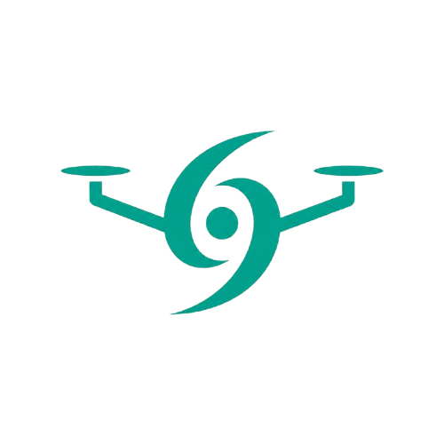
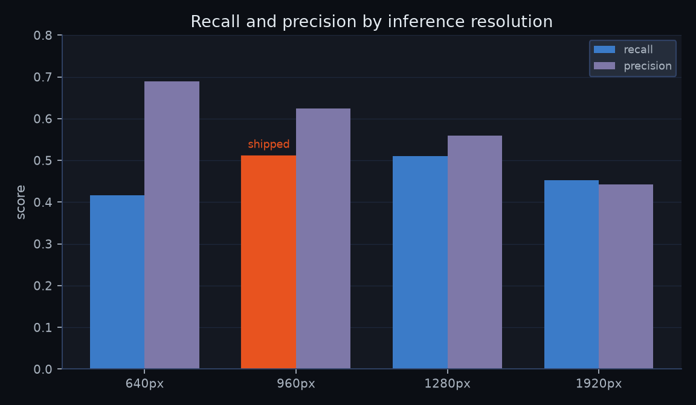
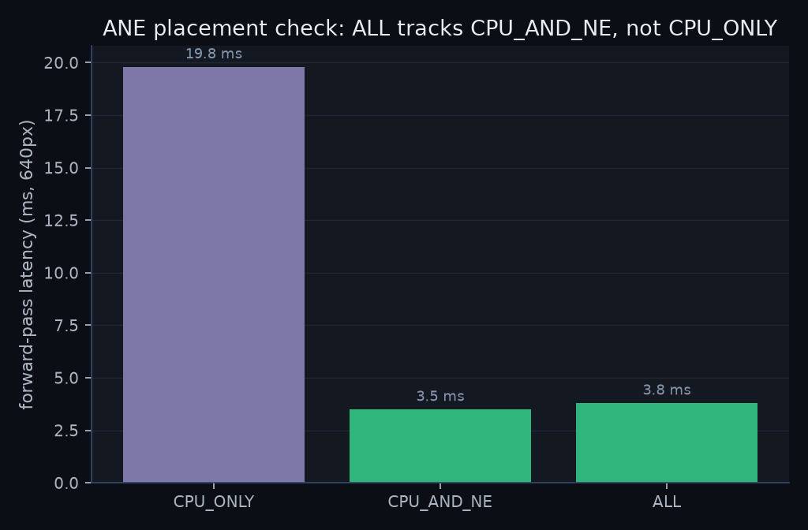

<div align="center">



# HADES Technical Overview

### Hurricane Autonomous Detection and Emergency System

**A ground station for post-hurricane drone search-and-rescue.**

</div>

---

## Contents

1. [What HADES is](#1-what-hades-is)
2. [System overview and signal chain](#2-system-overview-and-signal-chain)
3. [The aircraft](#3-the-aircraft)
4. [The processing pipeline](#4-the-processing-pipeline)
5. [Detection model and training](#5-detection-model-and-training)
6. [The localization math](#6-the-localization-math)
7. [Uncertainty quantification](#7-uncertainty-quantification)
8. [Telemetry and time-sync](#8-telemetry-and-time-sync)
9. [Inter-process transport](#9-inter-process-transport)
10. [The coordinator interface](#10-the-coordinator-interface)
11. [Measured performance](#11-measured-performance)
12. [Limitations and honesty](#12-limitations-and-honesty)

---

## 1. What HADES is

After a hurricane, the fastest way to find people is from the air, and the slowest part of an
air search is a human staring at a screen. A survivor in a 4000-pixel aerial frame is a handful
of pixels; a spotter misses them, and even when they see one, translating "there, near the tree
line" into a coordinate a ground team can walk to is error-prone and slow.

HADES closes that loop automatically. An FPV drone flies the search area and streams video to a
laptop on the ground. HADES is the **ground station** that receives the feed: it runs real-time
human detection on every frame, turns each detection into a real-world coordinate with an honest
uncertainty radius, and plots the contacts on a live map in a coordinator interface. The entire
loop, detect to localize to display, runs on a single fanless MacBook Air with the network off.

Two design commitments run through the whole system and are worth stating up front, because they
shape every technical decision below:

- **The video never blocks.** Video displays at full frame rate. Detection, tracking, and
  localization run decoupled, so a survivor pin never costs the operator a dropped frame. Under
  load the system degrades the processed-detection rate, never the video.
- **No false precision.** Every located contact carries an uncertainty radius that reflects the
  real sensor error. When the geometry cannot support a confident coordinate, HADES says so
  loudly (a large circle, or a direction instead of a point) rather than dropping a pin that
  lies. This honesty is the project's flagship contribution, and section 7 explains why the
  uncertainty is genuinely calibrated rather than decorative.

---

## 2. System overview and signal chain

HADES is the ground half of a two-part system: an aircraft in the air and a laptop on the
ground. Two links come off the aircraft, on **separate radios**.

```
   DRONE (in the air)                          GROUND STATION (one laptop)
 ┌─────────────────────┐                     ┌──────────────────────────────────────────┐
 │  DJI O4 camera  ─────┼── digital video ───┼─► HDMI/UVC capture ─► Python service      │
 │  (fixed mount)       │                     │       │                 detect → track    │
 │                      │                     │       │                 → project → fuse  │
 │  F405 FC + M10 GPS ──┼── CRSF telemetry ──┼─► ELRS USB serial ──────┘        │        │
 │  ELRS radio          │   (pose: lat/lon/   │                                  ▼        │
 └─────────────────────┘    alt/attitude)     │    two localhost WebSockets ─► Electron   │
                                              │    (frames + detections)      coordinator │
                                              │                                UI (map)   │
                                              └──────────────────────────────────────────┘
```

The **DJI O4** air unit flies the camera view down as a digital video feed. On the ground it
reaches the laptop through the DJI goggles' HDMI output into a USB **UVC capture** device, so the
video arrives as an ordinary webcam-style stream. Separately, the **ELRS** radio carries low-rate
**CRSF telemetry** (the aircraft's GPS position, altitude, and attitude) into the laptop over USB
serial. Keeping video and telemetry on independent radios means a glitch on one link does not take
down the other.

On the laptop, two processes cooperate:

- A **Python detection service** owns the vision-and-math pipeline: capture, detect, track,
  georeference, fuse, and quantify uncertainty.
- A **coordinator UI**, an Electron desktop app, draws the results: a live map, the video with
  overlays, a contact list, and a mission log.

The service and the UI are two processes on one machine, connected over two localhost WebSocket
channels aligned frame-by-frame (section 9). Splitting them this way lets the compute-heavy
Python run at its own pace while the UI stays responsive, and lets the same UI attach to a live
service, a recorded replay, or a canned demo without changing a line. Nothing leaves the machine.

<div align="center">

</div>

---

## 3. The aircraft

The ground station is only half the system; the other half flies. The drone is built, not
bought: a 3D-printed airframe carrying an off-the-shelf FPV and telemetry stack. Every part is
chosen for the job of finding people in the hour after a storm.

| Part | Role |
| --- | --- |
| **3D-printed airframe** | A monocoque printed in-house that carries the whole stack. |
| **Speedy Bee F405 flight controller** | Runs Betaflight, keeps the aircraft level, and streams attitude (roll, pitch, yaw) and GPS telemetry, which the localizer turns into coordinates. |
| **DJI O4 Air Unit Lite + camera** | The digital video link. Fixed mount, no gimbal, so the camera pitch is the mount angle plus the airframe's own pitch. Flies the survivor's-eye view down to the laptop. |
| **ELRS Nano RX** | The control link, plus a second telemetry path (CRSF) read over USB serial on the ground. |
| **HGLRC M10 GPS** | Position and altitude for every frame's pose. |
| **2306 motors, 5-inch tri-blades** | Four of each. Sized for post-storm wind, not for racing. |
| **6S battery** | Sets the flight time; every choice upstream is weighed against the air time it costs. |

Two properties of this hardware drive the software design directly:

- **No gimbal.** The O4 is fixed-mounted, so the camera boresight is rigid to the airframe. The
  projection math (section 6) therefore composes the airframe attitude with a fixed camera-mount
  rotation, with no gimbal angles to read.
- **No magnetometer.** An FPV quad of this class has no usable compass. Heading has to come from
  GPS course-over-ground and a drifting gyro, and course is not the same as heading when the
  aircraft crabs into wind. This single fact is the dominant error source in localization, and
  section 7 is largely about quantifying it honestly rather than pretending it away.

---

## 4. The processing pipeline

One survivor flows through seven stages, each with a single responsibility and no reach across
the boundary. This strict separation is what lets any stage be swapped (a different detector, a
recorded frame source, a live capture) without disturbing the rest.

```
FrameSource → Detector → Tracker → Projector → Confirmation → Fuse+Quantify → UI
```

**FrameSource** yields `(frame, timestamp, seq)` where `seq` is the monotonic `frame_id` used to
align everything downstream. It tolerates dropped frames, mid-stream resolution changes, and link
loss. A single-slot **drop-to-latest** buffer means a slow consumer skips whole frames rather than
falling behind. Implementations are swappable: a synthetic source (deterministic gradients for
tests), a recorded-file source (PyAV decode with VideoToolbox hardware acceleration), and a live
UVC capture source. `service/src/hades/ingest/`

**Detector** is a stateless `frame → Detection[]` (box, class `person`, confidence). It knows
nothing about time or the world. The model is YOLO11s fine-tuned for tiny aerial people (section
5), and the detector is injected into the loop, so the pipeline never imports a hardware backend
directly and runs identically against a stub, an ONNX CPU model, or the Core ML model on the
Neural Engine. Detections are **always emitted** downstream; recall-first is a hard rule, and
whether a detection is shown prominently is Confirmation's job, not the detector's.
`service/src/hades/detect/`

**Tracker** gives detections persistent IDs and bridges the 10 fps detector to 30 fps video. It
is a from-scratch NumPy **ByteTrack**: an 8-dimensional constant-velocity Kalman filter with state
`[cx, cy, aspect, height, and their velocities]`, two-stage association (high-confidence
detections matched first, then low-confidence detections against the leftovers), an
intersection-over-union cost matrix solved by the Hungarian algorithm
(`scipy.optimize.linear_sum_assignment`), and a `tentative → confirmed → lost` lifecycle. Track
IDs are strictly monotonic and **never reused**, so a survivor's ID is stable. Between the 10 fps
detection updates, the Kalman filter coasts each track forward, which is exactly how the 10 fps
detector keeps up with 30 fps video. `service/src/hades/track/`

**Projector** turns each detection into a world coordinate: it casts a ray through the box's
**bottom-center** pixel (the person's feet) and intersects it with the ground. This is cheap and
runs on every detection, with no Monte Carlo; it exists so that Confirmation can cluster contacts
in world space. `service/src/hades/locate/projector.py`

**Confirmation** decides **display priority, never visibility**. A real detection is always shown;
Confirmation only ranks how strongly to present it. It runs a leaky-integrator score (each frame
the score decays by 0.9 and a hit adds the detection confidence), promotes across tiers
(`CONTACT → CANDIDATE → STRONG`) with Schmitt-trigger hysteresis so a contact does not flicker at
a threshold, and corroborates with world-space clustering so several frames agreeing in the same
place count for more than one loud frame. Only STRONG contacts are handed to the expensive Fuser.
`service/src/hades/confirm/confirmation.py`

**Fuse + Quantify** (the localizer) is where a survivor gets a coordinate with an honest radius.
It fuses a confirmed contact's per-frame ground points into a single best estimate, runs a Monte
Carlo to turn sensor error into a real uncertainty ellipse, and classifies the result into an
actionability band. This is sections 6 and 7. `service/src/hades/locate/fuse.py`

**Coordinator UI** shows one contact in three projections (map, video, list) over a single global
selection model. Section 10.

The whole thing is orchestrated by `ServiceLoop` (`service/src/hades/service/loop.py`), which for
each aligned frame runs detect, track, project, confirm, and (for promoted contacts) fuse, then
emits the frame and its results over the wire.

---

## 5. Detection model and training

### 5.1 The model

The detector is **Ultralytics YOLO11s**, the small variant of an anchor-free, single-stage
detector, fine-tuned from COCO weights to a single `person` class. Input is a **960×960** square.
Preprocessing is standard Ultralytics **letterbox**: the frame is scaled isotropically to fit,
centered on a 960×960 canvas, and padded with gray (value 114), in RGB channel order. The Core ML
model bakes the `/255` normalization into the graph and takes a `uint8` image directly; the ONNX
fallback takes an explicit float32 NCHW tensor.

The detection head emits a `(1, 84, 8400)` tensor at COCO width; for the single-person model the
person channel is selected, boxes `(cx, cy, w, h)` are read in letterbox pixels, converted to
corner form, **un-letterboxed back to original-frame pixels**, and passed through greedy
non-maximum suppression (confidence threshold 0.25, IoU threshold 0.7 by default). A coordinate
never escapes the detector in letterbox space; every downstream stage sees original-frame pixels.
`service/src/hades/detect/{preprocess,postprocess}.py`

### 5.2 Export and runtime

The model is exported to a **Core ML `.mlpackage`, FP16, with `ComputeUnits.all`**, which lets
Core ML place it on the **Apple Neural Engine**. The `CoreMLDetector` reads input and output
tensor names from the model spec rather than hard-coding them. An ONNX CPU path exists so
continuous integration can run the real detector with no torch and no Neural Engine.

One dependency subtlety is load-bearing: `coremltools` 9.0's Torch frontend casts arrays with
`int(ndarray)`, which **NumPy 2.x** rejects. The fix is to pin `numpy<2` in the bench group rather
than downgrade the toolchain, because Ultralytics 8.4 requires `coremltools >= 9.0`.
`service/src/hades/detect/`, `service/pyproject.toml`

### 5.3 Training

The model was fine-tuned on **HERIDAL + SARD**, two aerial search-and-rescue datasets, as the
anchor domain. Training ran on an **NVIDIA H200** (the NCShare cluster) for 100 epochs at 960
resolution, batch 64, seed 0, deterministic, with Ultralytics' built-in augmentation.

**VisDrone was evaluated as a pretraining stage and rejected.** Two arms were trained
byte-identically except for the starting weights: Arm A fine-tuned from COCO `yolo11s.pt`, Arm B
from a VisDrone-pretrained checkpoint. Arm A beat Arm B on recall at every matching tolerance
(VisDrone traded recall for precision), so **Arm A ships**.

<div align="center">

</div>

**Input resolution 960 was chosen empirically.** On the held-out HERIDAL test set, recall by
resolution was 0.417 at 640, **0.510 at 960**, 0.511 at 1280, and 0.452 at 1920. The rule was
"the smallest resolution whose recall ties the best, subject to clearing 10 fps." 960 ties 1280
within noise but with better precision, clears the frame-rate gate comfortably, and 1920 actually
degrades (false positives explode at a scale the model never saw in training).

**A scene-leakage bug in the public split was corrected.** Roboflow's HERIDAL export splits by
frame, so all 14 test scenes also appeared in training (21 test images were pixel-identical to a
training image). HADES **re-splits by whole scene** (seed 0, roughly 20% held out), guarded two
ways: scene-code disjointness and a decoded-pixel SHA-256 backstop. The held-out test scenes are
CAP, JAS, and ZRI. This is an honest held-out estimate, **not the official HERIDAL split**, so the
numbers are not directly comparable to published benchmarks.

### 5.4 Metrics

Evaluation uses **center-distance matching** (a detection matches a ground-truth person if their
centers are within 50 px on the native 4000-px frame), which is stricter and more operationally
meaningful for tiny targets than IoU. On 376 held-out frames (1438 person instances):

<div align="center">

</div>

| Operating point (confidence) | Recall | Precision |
| --- | --- | --- |
| 0.25 (strict default) | 0.55 | 0.68 |
| 0.10 | 0.63 | 0.46 |
| 0.05 (recall-first, fielded) | **0.69** | 0.37 |

Recall is operating-point-driven. At the strict 0.25 default the shipped FP16 Core ML model gives
**recall 0.551, precision 0.676** (793 true positives, 380 false positives, 645 misses). At a
recall-first threshold, the setting a real SAR mission uses, single-frame recall is about **0.69**,
and higher again after multi-frame confirmation. FP16 quantization did **not** cost accuracy; the
Core ML model actually scored slightly higher than its float proxy.

This sits below the **0.80 recall floor** that was pre-registered against a looser IoU-mAP scale
(HERIDAL's IoU-mAP50 state of the art is around 0.83, and this model reaches mAP50 0.95 at
training resolution). The acceptance test here is a stricter center-distance match on native
4000-px frames downsampled to 960 inference, where a 62-px person becomes roughly 15 px. The gap
is reported faithfully rather than reframed. A **selection-optimism** caveat applies too: 960 was
chosen on the same held-out set, so these numbers will move when curated disaster footage lands.

<div align="center">

</div>

---

## 6. The localization math

Turning a person-shaped patch of pixels into a coordinate on a map is the heart of the system. It
happens in two steps: a geometric projection that gives a single best-guess coordinate (this
section), and a Monte Carlo that turns the sensors' error into an honest uncertainty radius
(section 7). The ray-to-ground math lives in exactly one module, imported by both the Projector
and the Fuser, never re-implemented. `service/src/hades/locate/geometry.py`

### 6.1 The frames

There is one camera and no depth sensor, so a single detection is not a point in space; it is a
**ray**. HADES casts that ray from the camera, through the aircraft's known pose, and intersects
it with the ground. The model is **flat-earth v1** in a local **ENU** (East-North-Up) tangent
plane centered under the drone, on the WGS84 ellipsoid. The transform chain runs:

```
pixel  →  camera optical frame  →  aircraft body frame  →  ENU world frame  →  ground plane
```

### 6.2 Pixel to coordinate

Given a pixel `(u, v)` at the person's feet (the box bottom-center), the camera intrinsics matrix
`K = [[fx, 0, cx], [0, fy, cy], [0, 0, 1]]`, the aircraft attitude `(roll, pitch, yaw)`, the fixed
camera boresight, the drone altitude, and the ground elevation:

```
ray_cam = K⁻¹ · [u, v, 1]ᵀ                       # direction in the camera's optical frame
d       = R_world_body · R_body_cam · ray_cam    # rotate that ray into ENU world coordinates
require d_up < 0                                  # the ray must point at the ground, or reject
H       = drone_alt − ground_elev                 # height above ground (AGL)
t       = −H / d_up                               # scale the ray down to the ground plane
east    = t · d_east ,  north = t · d_north
lat     = drone_lat + north / 111320
lon     = drone_lon + east  / (111320 · cos(lat))
```

`R_world_body` is the aircraft's attitude, built as an aerospace intrinsic ZYX Euler rotation
(from the flight controller's roll/pitch/yaw) composed with a fixed adapter from the body frame's
forward-right-down convention into ENU. `R_body_cam` is the fixed mount of the gimbal-less O4
camera; because the camera is rigid to the airframe, the effective camera pitch is simply the
mount angle plus the airframe pitch, with no gimbal reading required.

### 6.3 The refusals

The projection is written to **refuse to invent a pin** rather than return a confident, wrong
coordinate. `ray_to_ground` raises (and the service loop catches it and emits an honest CUE-ONLY
contact) whenever:

- there is no GPS fix, or any attitude value is missing (the geometry never assumes the aircraft
  is level and pointing north);
- the vertical datums do not match. Altitudes are tagged `HAE | MSL | REL_TAKEOFF | UNKNOWN`, and
  a height is only computed by subtracting two identical, known datums. On a hurricane coast the
  geoid sits 25 to 35 m below the ellipsoid, so silently mixing datums would inject about 30 m of
  vertical error straight into the coordinate;
- the height above ground is not positive, or the ray points at or above the horizon.

This is the difference between a tool a coordinator can trust and one that occasionally sends a
team to the wrong field.

---

## 7. Uncertainty quantification

The projection in section 6 is exact given perfect inputs. The inputs are not perfect, and the
whole point of HADES is to say **how imperfect** honestly.

### 7.1 Why heading dominates

A single degree of heading error moves the ground point by roughly **1.75 m per 100 m of range**.
Pitch and roll are good to a degree or two and the boresight to a tenth of a degree, but the FPV
quad has no magnetometer, so heading comes from GPS course and a drifting gyro, and course is not
heading when the aircraft crabs into wind (5 to 40 degrees of error is realistic). The problem is
**heading-limited, not algorithm-limited**: the projection geometry is settled: a single inverse
ray; the flagship engineering is quantifying the heading error honestly and refusing to hide it.

<div align="center">

</div>

### 7.2 Fusion, then Monte Carlo

A confirmed, stationary contact is seen across many frames. HADES first **fuses** the per-frame
ground points with a full information-weighted (inverse-covariance) mean,
`x̂ = Λ⁻¹ Σ(Σᵢ⁻¹ xᵢ)` with `Λ = Σ Σᵢ⁻¹`, where each per-frame covariance `Σᵢ` is a cheap
linearized (finite-difference Jacobian) propagation of the input error through `ray_to_ground`.
This is a batch weighted mean, the correct estimator for a stationary target, and it is
re-entrant, so an operator can promote a track to a full localization on demand.

It then runs a **Monte Carlo over the fusion**. Each realization perturbs every input by its
calibrated sensor error (GPS horizontal and vertical, roll/pitch/yaw jitter, pixel jitter and
foot bias, ground-elevation, and time-sync offset) and re-projects through the same
`ray_to_ground`. Draws whose ray goes above the horizon are rejected transparently, and if the
reject fraction is high the contact is forced to CUE-ONLY at a floor radius.

The one subtlety that makes the whole thing honest: the **heading bias is drawn once per contact
and shared across all its frames**, while the per-frame jitter is drawn independently. This is
deliberate. A heading bias that was redrawn every frame would average out across a multi-frame
fusion and fake a precision the geometry cannot deliver, a "smug filter" that reports a tight
circle it has not earned. Because the bias is common-mode, it does **not** average away, so the
reported radius **asymptotes to a floor that grows with range** (the heading lever arm) instead of
shrinking toward zero. This is the single most important correctness decision in the localizer.

### 7.3 What comes out

For each contact the Monte Carlo yields a 2×2 ENU covariance, from which HADES reports:

- a **95% confidence ellipse** (semi-axes scaled by `√χ²₂,₀.₉₅ ≈ 2.45`, oriented by the covariance
  eigenvectors), the expert overlay on the map;
- **R95**, the headline number: the **empirical 95th-percentile radius** of the sample cloud about
  the estimate. This is a genuine sample quantile, not the ellipse's major semi-axis, which would
  overstate the equal-coverage circle;
- a **NEES** diagnostic (normalized estimation error squared, target around 2) that checks the
  reported spread actually matches the observed error, and a residual test that flags a target
  that is moving rather than stationary.

Each contact then lands in one of four **actionability classes** by its R95, so an operator reads
intent, not just a number:

| Class | R95 | Meaning |
| --- | --- | --- |
| **PINPOINT** | ≤ 5 m | walk straight to it |
| **SWEEP** | ≤ 25 m | a short line search |
| **AREA** | ≤ 100 m | search the neighborhood |
| **CUE-ONLY** | > 100 m | a direction, not a location |

A single straight pass with little aspect diversity is **capped at SWEEP** no matter how tight the
math looks, because only viewing a survivor from several angles actually breaks the heading limit.

### 7.4 Is the uncertainty real?

An uncertainty number is only useful if it is calibrated: does the reported 95% circle actually
contain the true location 95% of the time? HADES validates this against a calibrated simulator.

<div align="center">

</div>

The credibility check is the anti-circularity test. Under a matched control, coverage lands around
93 to 97%: the arithmetic is right. But when an out-of-schema error the Monte Carlo cannot
model, a time-sync offset between video and telemetry, is injected, coverage **collapses**, and
crucially the fused coverage drops **below** the single-frame coverage. If the Monte Carlo were
secretly absorbing the bias, fusing more frames could not make coverage worse. That it does is the
evidence that the metric measures the world, not its own math. A moving target likewise stays in a
converging state with a large radius and never reports PINPOINT.

An earlier design used an additive analytic bias floor; it under-covered (matched coverage 0.46)
and was superseded by the Monte-Carlo-over-fusion approach (matched coverage 0.99), which has the
same non-shrinking behavior but is honest.

> **All localization meter-numbers are from a calibrated synthetic simulator**, not yet
> field-validated. They prove the method is correct and the uncertainty is honest; they will move
> when the real labeled-with-pose flight set lands. The simulator reports median, mean, p90, and
> max error plus empirical coverage, stratified by slant range and camera pitch.

---

## 8. Telemetry and time-sync

For the geometry to work, every video frame needs the aircraft pose at the instant that frame was
captured. HADES models pose as a `Pose(t, lat, lon, alt, alt_datum, roll, pitch, yaw, ...)` where
any unobservable field is honestly `None` rather than a silent zero. A source that cannot observe
attitude leaves roll/pitch/yaw `None`, and the geometry refuses rather than assuming level flight.
GPS course-over-ground is never stuffed into the yaw field, because course is not heading.

Two `TelemetrySource` adapters feed poses in:

- **`SrtFileSource`** replays the O4's `.srt` telemetry sidecar against recorded video. It is
  high-rate but **position-only** (the O4 sidecar carries no attitude), which is why replaying it
  honestly yields CUE-ONLY contacts: the geometry has no attitude and refuses to fake one. This is
  the validation path.
- **`CrsfSerialSource`** reads live CRSF telemetry off the ELRS radio's USB serial port. It is
  stubbed in v1 and built out with the hardware in hand; it carries the full attitude the
  geometry needs.

Sync aligns pose to frame by **timestamp interpolation**: each frame's pose is linearly
interpolated between the two telemetry samples that bracket its capture time (a value match on the
clock, immune to index drift). The alignment is tagged with provenance: `OK` (an exact hit),
`INTERPOLATED` (between two in-range samples), `EXTRAPOLATED` (clamped past the sample span),
`STALE` (the bracket gap exceeds the limit, default 2 s), or `MISSING`. Any `None` endpoint
propagates to `None`; nothing is defaulted. A deliberate clock-offset knob injects the same
time-sync error the Monte Carlo samples, which is how the anti-circularity coverage test in
section 7.4 is driven. `service/src/hades/ingest/{telemetry_source,sync}.py`

---

## 9. Inter-process transport

The Python service and the Electron UI talk over **two localhost WebSocket channels**, aligned by
`frame_id`. `service/src/hades/ws/`, `service/src/hades/service/loop.py`

- A **binary channel** streams JPEG-encoded frames (quality 80), one per displayed frame.
- A **JSON channel** (bidirectional) carries a per-frame `DetectionMessage` (the boxes for that
  frame) and any `ContactRecord`s (located contacts with their R95, ellipse, actionability class,
  and diagnostics). The client can also send commands back, most importantly `{type: "promote",
  track_id}`, which triggers an on-demand localization and returns the resulting contact directly
  to the requester.

The alignment rule is simple and strict: the JPEG, the detection message, and every contact for a
given frame all carry the **same `frame_id`** (equal to the FrameSource `seq`). The UI joins on
that key, so an overlay never lands on the wrong frame. Each client has a size-1, latest-wins
queue, so a slow consumer drops whole frames instead of back-pressuring the pipeline.

Electron supervises the Python service as a child process: it spawns `uv run hades-service` with
the port arguments, inherits its stdio, logs a non-zero exit, and sends SIGTERM when the app
closes. An environment flag lets an automated test harness supply its own service instead. The
renderer connects to the WebSockets directly with context isolation on.
`ui/electron/main.ts`

---

## 10. The coordinator interface

The UI is an **Electron + React + TypeScript** app built with **Vite** and **Tailwind**, with
**Zustand** for state and **MapLibre GL** for the map. Its organizing idea is that a survivor is
**one Contact seen in three projections**, and the operator must never lose them between views.
`ui/src/`

### 10.1 The selection spine

State is split into small independent Zustand stores (contacts, selection, mission log, system,
telemetry, layers, theme, provenance). The **selection store** holds only a `selectedId` and a
`hoveredId`, both track IDs, never contact data. Because selection is just an ID, it survives
re-sorting, refinement, and a contact's coordinate changing under it. All three projections read
this one store, so clicking a survivor anywhere selects them everywhere.

### 10.2 The three projections

- **Map** (`MapView.tsx`): a MapLibre GL map on an **offline PMTiles basemap** (Protomaps vector
  tiles, cached before a mission), with reticle pins and GeoJSON uncertainty circles per contact.
  Clicking a pin selects that track. Pins cluster at low zoom.
- **Video** (`VideoPanel.tsx`): the JPEG feed with detection boxes drawn from the matching
  `frame_id`, color-coded by freshness (fresh vs coasting), with an explicit "LINK LOST · FROZEN"
  overlay when the feed stalls and a "SYNTHETIC FEED · DEMO" badge in demo mode.
- **List** (`ContactList.tsx`): a sortable table of contacts; a row click selects, hover
  highlights, and the selected contact is emphasized.

### 10.3 Honest chrome

- **Coordinates** are shown in the two formats a ground team and an air asset actually speak:
  **MGRS/USNG** grid (primary, the US SAR and FEMA standard, 10 m precision) and **WGS84
  decimal-degrees-minutes** (secondary). A null fix renders "NO FIX", never a phantom coordinate.
- **The status strip degrades visibly.** It shows link state, telemetry age, GPS fix and
  satellites, and a frame heartbeat. As telemetry ages, localization confidence is decayed
  linearly toward zero, degrading the reported confidence, never the video frame rate.
- **The mission log** is append-only: every detection, clearance, snapshot, and link event is
  written with a monotonic id and timestamp, so a coordinator has an auditable record.
- **Demo mode** is labeled honestly: a banner states which numbers are real localizer output and
  which are scripted scene and pose, and reports the localizer's median error against the known
  ground truth of the scripted scene.

The UI ships light (day) and dark (night) themes, and a **mock WebSocket server** replays canned
frames and detections deterministically so the Playwright tests run fully offline against the
real UI code.

---

## 11. Measured performance

Every number here traces to a real artifact from a build phase. Detection is on the
leakage-guarded HERIDAL scene split (section 5); localization is from the calibrated simulator
(section 7); latency is an in-app measurement.

### 11.1 Latency

The budget is **in-app glass-to-glass**, from a frame arriving on the socket to being painted with
its overlay and map pin, at **120 ms** (the drone-link latency is outside the app and excluded).
Measured in-app over 90 frames: **p50 1.9 ms, p95 22.4 ms, max 33.6 ms**, clearing the budget by
more than 5×.

<div align="center">

</div>

This is a **floor**: it was measured on a dev/CI machine under software GL with a small canned
frame. The binding field figure, on M4-class hardware with real-resolution frames, is a pending
on-device run.

### 11.2 Detection throughput

Detection must clear **10 fps**, decoupled from the full 30 fps video. On a fanless **MacBook Air
M4 (32 GB)**, the FP16 model with `ComputeUnits.all` sustains, over 300 timed frames:

<div align="center">

</div>

| Resolution | Detector throughput (ANE) | Clears 10 fps gate |
| --- | --- | --- |
| 640 px | 293 fps | yes |
| **960 px (shipped)** | **63 fps** | yes |
| 1280 px | 57 fps | yes |

Even 1280 clears the gate by more than 5×. The Neural Engine placement was verified directly: at
640 px, `CPU_ONLY` runs at 19.8 ms/frame while `CPU_AND_NE` and `ALL` run at about 3.5 ms, a
**≈5.6× speedup**, confirming the model is actually served on the ANE and not silently falling
back to the CPU.

<div align="center">

</div>

### 11.3 Hard constraints held

The detect-localize-display loop runs with the **network off** (no cloud inference, no runtime
model or tile fetch, no telemetry phone-home). It stays functional on a fanless MacBook Air by
degrading the processed-detection rate, never the video. The only allowed network use is
pre-downloaded offline map tiles and an optional, operator-triggered post-mission export once
connectivity returns.

---

## 12. Limitations and honesty

HADES is deliberately built to disclose its limits rather than hide them, so the honest ledger is
part of the technical record:

- **Localization meter-numbers are simulated, not yet field-validated.** They come from a
  calibrated synthetic simulator whose noise models are tuned to the sensor-error literature. They
  demonstrate the method is correct and the uncertainty is calibrated; the absolute meters will
  move when the labeled-with-pose flight dataset lands.
- **Detection metrics are on a custom by-scene re-split**, not the official HERIDAL split, so they
  are not directly comparable to published benchmarks, and they carry a selection-optimism caveat
  (the input resolution was chosen on the same held-out set). Reported recall (0.55 strict, ~0.69
  fielded) sits below the pre-registered 0.80 floor for the reasons in section 5.4, and that gap is
  reported rather than reframed.
- **Localization is heading-limited.** With no magnetometer, heading is the dominant error source.
  The system's response is to quantify it honestly (section 7), cap single-pass geometry at SWEEP,
  and treat aspect diversity as the real cure, not to claim a precision it cannot support.
- **The live serial telemetry path (`CrsfSerialSource`) is stubbed in v1**, and PyInstaller
  bundling of the service is deferred; v1 runs the service via `uv run`.
- **The vertical-datum question** (whether the GPS altitude is HAE or MSL) is tagged and
  asserted-on rather than assumed, pending confirmation against the real flight dataset.
- **The latency figure is a dev-machine floor**, not the binding field number.

None of these are hidden in the codebase or the reported numbers, which is the point: a
search-and-rescue tool earns trust by being right about what it does not know.

---

<div align="center">
<sub>HADES · on-device search-and-rescue · built by students at NCSSM</sub>
</div>
